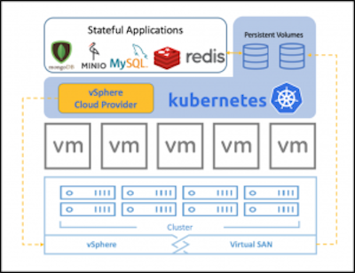

## Overview
Containers are stateless and ephemeral but applications are stateful and need persistent storage. vSphere adds this persistent storage support to Kubernetes through interface called Cloud Provider. Cloud provider is an interface which helps in extending Kubernetes with cluster of instances managed by virtualisation technologies, public/private cloud platforms and required networking for these instances. 
 
 
 
 
Kubernetes cloud provider is an interface to integrate various nodes (i.e. hosts), load balancers and networking routes. This interface allows extending Kubernetes to use various cloud and virtualisation solutions as base infrastructure to run on. 
 
Cloud provider provides following interfaces to effectively integrate cloud platforms:

* **Instances** - interface for virtual machine management
* **Load Balancers** - interface to integrate with load balancer provided by cloud platform
* **Routes** - interface to add new routing rules of cloud platform
* **Zones** - integrate with zones if implemented by cloud platform

## vSphere Storage Concepts
vSphere is one of the cloud providers of Kubernetes and thus allows Kubernetes Pods use enterprise grade storage. vSphere Storage (VMFS, vSAN, NFS) has proven features like policy based management, QoS, high availability and data reliability for containers using Kubernetes.
 
Datastores is an abstraction which hides storage details and provide uniform interface for storing persistent data. Datastores enables simplified storage management with features like grouping them in folders. Depending upon the backend storage the datastores can be vSAN, VMFS or NFS.
 
vSAN is a hyper-converged infrastructure storage which provides excellent performance as well as reliability. vSAN advantage is simplified storage management with features like policy driven administration. 
 
VMFS (VMware FIle System) is a cluster file system that allows virtualization to scale beyond a single node for multiple VMware ESX servers. VMFS increases resource utilization by providing shared access to pool of storage.
 
NFS (Network File System) is distributed file protocol to access storage over network like local storage. vSphere supports NFS as backend to store virtual machines files.

## Kubernetes Storage support
vSphere supports all the the Kubernetes storage primitives which brings enterprise grade storage to Kubernetes. vSphere uses vSAN and VMFS datastores, these datastores store the volumes as VMDK files.

Kubernetes volumes can be defined in Pod specification where they reference VMDK files and these VMDK files are mounted as volumes when the container is running. When the Pod is deleted the Kubernetes volume is unmounted and the data in VMDK files persists.

 
 
  
vSphere is cloud provider which implements Instances interface and supports following Kubernetes storages primitives:

* Volumes
* Persistent Volumes
* Persistent Volumes Claims
* Storage Class
* Stateful Sets

